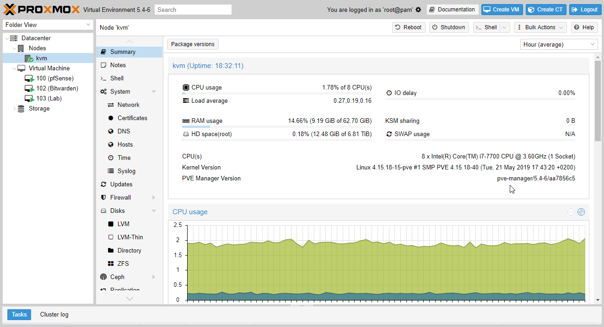
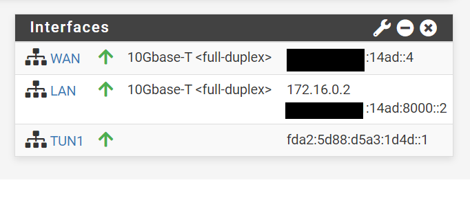
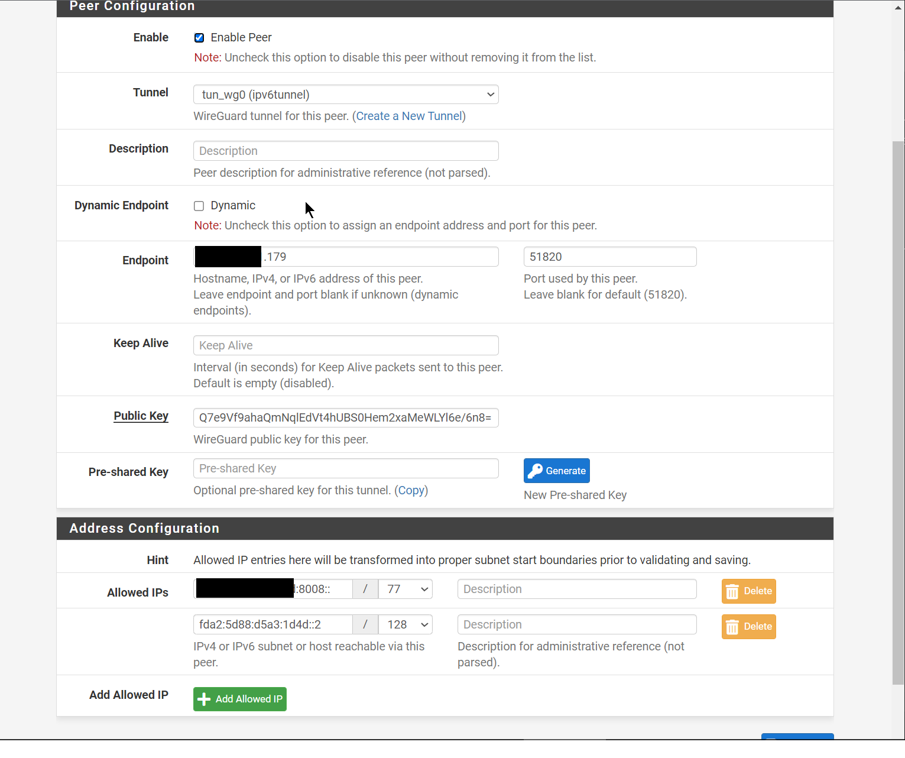
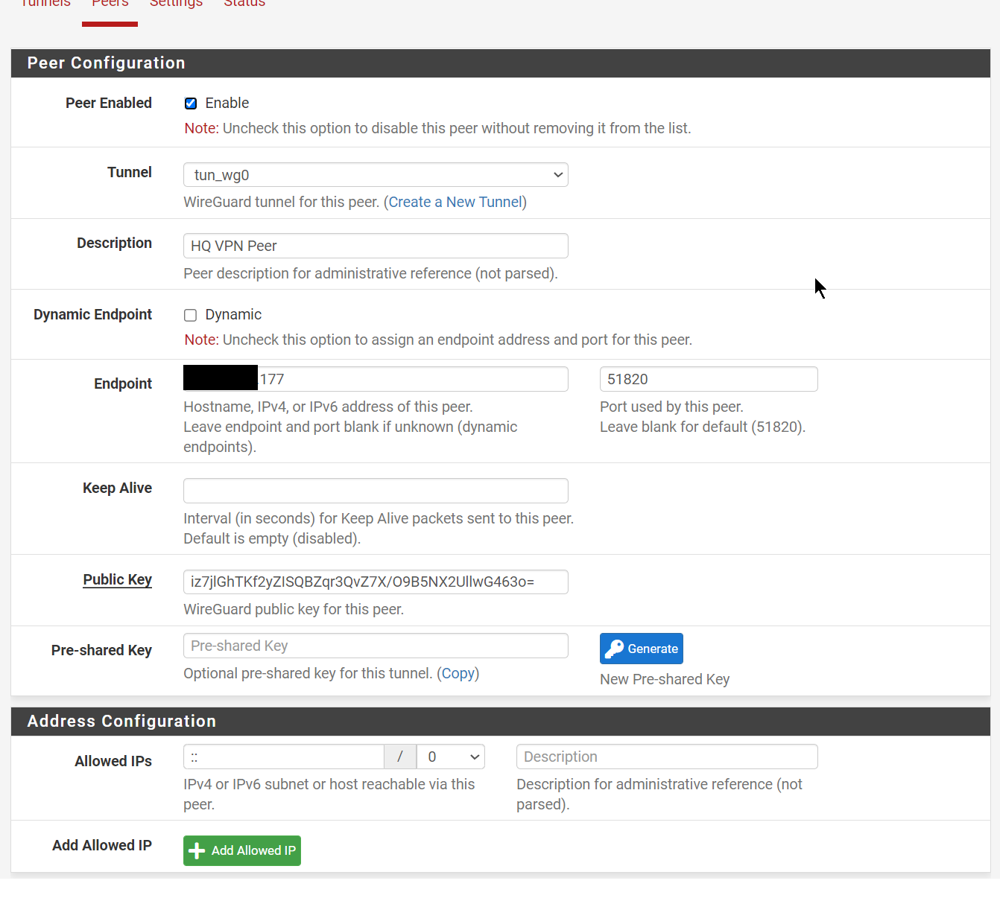
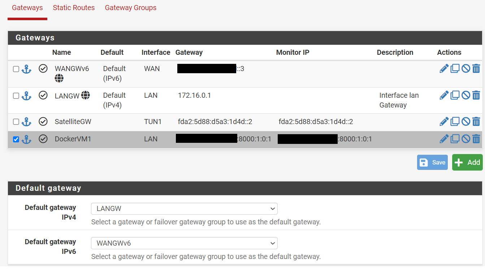
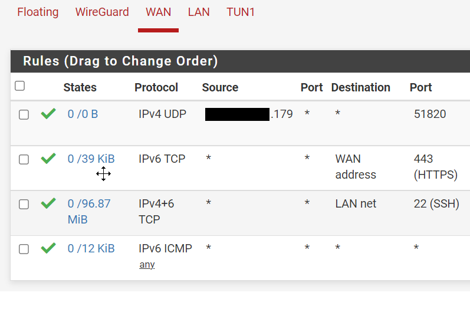
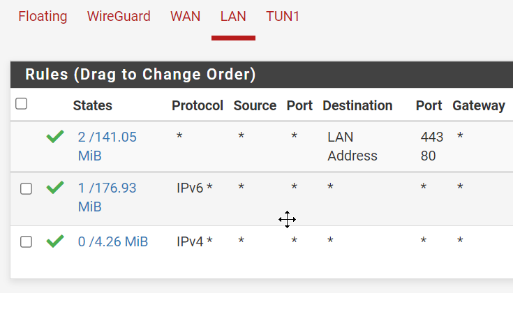

- [Diagram](#diagram)
- [Objectives](#objectives)
- [Requirements](#requirements)
  - [A IPv6 /64 network and a single IPv4](#a-ipv6-64-network-and-a-single-ipv4)
- [Hypervisor](#hypervisor)
  - [Bridges and Network interfaces](#bridges-and-network-interfaces)
- [Proxmox interface configuration](#proxmox-interface-configuration)
- [Firewall (pfSense)](#firewall-pfsense)
  - [Interfaces assignments in pfSense](#interfaces-assignments-in-pfsense)
    - [WAN](#wan)
    - [LAN](#lan)
  - [WireGuard](#wireguard)
    - [Proxmox KVM](#proxmox-kvm)
    - [Home network](#home-network)
  - [Routing in pfSense](#routing-in-pfsense)
  - [Firewall Rules](#firewall-rules)
  - [LAN DHCPv6](#lan-dhcpv6)
  - [](#)
- [VM configuration](#vm-configuration)
  - [Docker configuration](#docker-configuration)
## Diagram

## Objectives 
* Fully routed IPv6 and NATed IPv4 to VMs
   * Each VM will receive a IPv6 from a /77 subnet
     * Each container under this VM will receive an IPv6 automatically.
* IPv4 to IPv6 Tunnel using WireGuard
* Out of band Firewall
   * PfSense controlling the access to all public traffic
   * Having an out of band firewall, meaning outside of the VMs. This will increase the security of the system

## Requirements
### A IPv6 /64 network and a single IPv4
For this article, we will use a /64 IPv6 network because its what commonly assiged by ISPs or hosting providers.
This will be divided in 2 /65 subnets:
* RangeA: Will be used in the Host side, range:: to range:8000::
  * rangeA:14ad::/65
    * rangeA::2 (eth0)
    * rangeA::3 (vmbr0)
    * rangeA::4 (WAN in PfSense)
* RangeB: VM LAN, Containers and Tunnel, range:8000:: to range:ffff:ffff:ffff:ffff, divided in 4096 /77 subnets
  * rangeB:8000::/65
    * rangeB:8000::/77 (LAN in PfSense)
    * rangeB:8008::/77 (WireGuard Tunnel)
    * rangeB:8010::/77 (Docker in VM1)

## Hypervisor
We will need a way to provision VMs, for this article we selected Proxmox
More information: 
* https://www.proxmox.com/en/proxmox-ve/get-started
* How to install it remotely on any server: https://www.linkedin.com/pulse/installing-any-os-headless-server-rodrigo-leven/




### Bridges and Network interfaces
We will create 2 bridges and use the phisical network interface.

* **eth0:** Phisicall interface where we get our IPv4 and v6 traffic.
* **vmbr0**: Will be shared to PfSense as WAN
* **vmbr1**: Internal IPv4 network, will be shared as LAN

## Proxmox interface configuration
```
auto lo
iface lo inet loopback

# device: eth0
auto eth0
iface eth0 inet static
  address xxx.76.28.177
  netmask 255.255.255.255
  pointopoint xxx.76.28.161
  gateway xxx.76.28.161

iface eth0 inet6 static
  address rangeA::2
  netmask 128
  gateway fe80::1
  up sysctl -p

# for single IPs
auto vmbr0
iface vmbr0 inet manual
  bridge_ports none
  bridge_stp off
  bridge_fd 0

iface vmbr0 inet6 static
  address rangeA::3
  netmask 128
  up ip -6 route add rangeA::4 dev vmbr0
  up ip -6 route add rangeB:8000::/65 via rangeA::4  dev vmbr0

# for an additional IPv4 subnet
auto vmbr1
iface vmbr1 inet static
  address 172.16.0.1
  netmask 255.255.0.0
  bridge_ports none
  bridge_stp off
  bridge_fd 0
```
## Firewall (pfSense)
We will need an out of band Firewall to be able to whitelist open ports and for this, we are going to use pfSense.
 
More information here: https://docs.netgate.com/pfsense/en/latest/virtualization/virtualizing-pfsense-with-proxmox.html

We will add 3 network cards and configure each one to one of the Bridges we created before


### Interfaces assignments in pfSense

#### WAN
Default gateways for the VM hosts.
* IPv6: rangeA::4 /65
#### LAN
* IPv4: 172.16.0.2/16 (NATed from Host)
* IPv6: rangeB:8000::2 /77
### WireGuard
We configure WireGuard in a Site-to-Site setup as described here: https://docs.netgate.com/pfsense/en/latest/recipes/wireguard-s2s.html

With this configuration:

| Item          | Value                             |
| ------------- | --------------------------------- |
| Design        | Site-to-Site, one peer per tunnel |
| Tunnel Subnet | `fda2:5d88:d5a3:1d4d::/64`        |


#### Proxmox KVM

| Item           | Value                                                     |
| -------------- | --------------------------------------------------------- |
| Endpoint IP Address | `Home IPv4`                                            |
| TUN IPv6 Address | `fda2:5d88:d5a3:1d4d::1/64`                         |
| Listen Port    | `51820`                                                   |
| SatelliteGW | `fda2:5d88:d5a3:1d4d::2` via TUN interface |
| Static Route| 	`rangeB:8008::/77`	via SatelliteGW |



#### Home network
| Item           | Value                                               |
| -------------- | --------------------------------------------------- |
| Endpoint IP Address | `Proxmox IPv4`                                         |
| TUN IPv6 Address | `fda2:5d88:d5a3:1d4d::2/64`     |
| Listen Port    | `51820`                                             |
| LAN IPv6     | `rangeB:8008::1/77`  |
| GW IPv6 | `fda2:5d88:d5a3:1d4d::1/64` via TUN  |
| DHCPv6 on LAN|  `rangeB:8008:1::` to `rangeB:800f:ffff:ffff:ffff`
| RA on LAN| Assisted|



### Routing in pfSense

The default GW for IPv6 is rangeA::3 trough the WAN interface, this is because this interface is connected to the KVM bridge that has access to the connection to the internet.

Each Docker network in the VM host gets a static route so they can comunicate between each other.

For this we need to define a Gateway  as rangeB:8000:1:0:1 (VM1) trough the LAN interface called "DockerVM1" in the picture.

SatelliteGW is the gateway on the other side of the WireGuard Tunnel.



Finally we add a 2 static routes:
* Containers in VM1:  Our container subnet rangeB:8010::/77 can be reached trough the "DockerVM1" gateway that means trough the LAN interface via the host at rangeB:8000:1:0:1
* IPv4 to Ipv6 Tunnel: rangeB:8008::/77 will be served to clients connected to the WireGuard tunnel via the otherside of the TUN1 interface at fda2:5d88:d5a3:1d4d::2


### Firewall Rules
The rules to allow a Port in our IPv6 networks is done in the WAN interface.



Allow all IPv4 and IPv6 in the LAN interface

### LAN DHCPv6
* Enable DHCPv6 server with range: rangeB:8000:2:: to rangeB:ffff:ffff:ffff
* Enable Assisted RA
* 
### 
## VM configuration
* ifconfig
  
```
docker0: flags=4099<UP,BROADCAST,MULTICAST>  mtu 1500
        inet 172.17.0.1  netmask 255.255.0.0  broadcast 172.17.255.255
        inet6 rangeB:8010::1  prefixlen 77  scopeid 0x0<global>

ens19: flags=4675<UP,BROADCAST,RUNNING,ALLMULTI,MULTICAST>  mtu 1500
        inet 172.16.99.10  netmask 255.255.0.0  broadcast 172.16.255.255
        inet6 rangeB:8000:1:0:1  prefixlen 128  scopeid 0x0<global>
```
* route
```
::1 dev lo proto kernel metric 256 pref medium
rangeB:8000:1:0:1 dev ens19 proto kernel metric 100 pref medium
rangeB:8000::/77 dev ens19 proto ra metric 100 pref medium
rangeB:8008::/77 dev docker0 metric 1024 linkdown pref medium
rangeB:8010::/77 dev docker0 proto kernel metric 256 linkdown pref medium
rangeB:8010::/77 dev docker0 metric 1024 linkdown pref medium
fe80::/64 dev ens19 proto kernel metric 100 pref medium
fe80::/64 dev docker0 proto kernel metric 256 linkdown pref medium
default via fe80::3039:93ff:fe18:ccdd dev ens19 proto ra metric 20100 pref high
```


### Docker configuration
More information: https://docs.docker.com/v17.09/engine/userguide/networking/default_network/ipv6/#routed-network-environment

We configure docker to use a /77 subnets under rangeB

* /etc/docker/daemon.json
```
{
  "ipv6": true,
  "fixed-cidr-v6": "rangeB:8010::/77"
}

```
Test it by using an alpine container:

```
# docker run -it alpine ash
/ # ip -6 addr
1: lo: <LOOPBACK,UP,LOWER_UP> mtu 65536 state UNKNOWN qlen 1000
    inet6 ::1/128 scope host
       valid_lft forever preferred_lft forever
11: eth0@if12: <BROADCAST,MULTICAST,UP,LOWER_UP,M-DOWN> mtu 1500 state UP
    inet6 rangeB:8010:242:ac11:2/77 scope global flags 02
       valid_lft forever preferred_lft forever
    inet6 fe80::42:acff:fe11:2/64 scope link
       valid_lft forever preferred_lft forever
/ # ip -6 route
rangeB:8010::/77 dev eth0  metric 256
fe80::/64 dev eth0  metric 256
default via rangeB:8010::1 dev eth0  metric 1024
multicast ff00::/8 dev eth0  metric 256
/ # ping -6 www.google.com
PING www.google.com (2a00:1450:4001:810::2004): 56 data bytes
64 bytes from 2a00:1450:4001:810::2004: seq=0 ttl=115 time=5.769 ms
64 bytes from 2a00:1450:4001:810::2004: seq=1 ttl=115 time=5.885 ms
^C
--- www.google.com ping statistics ---
2 packets transmitted, 2 packets received, 0% packet loss
round-trip min/avg/max = 5.769/5.827/5.885 ms

```

From here we can see we got rangeB:ac11:2/77 and ping to Google over IPv6 works.

